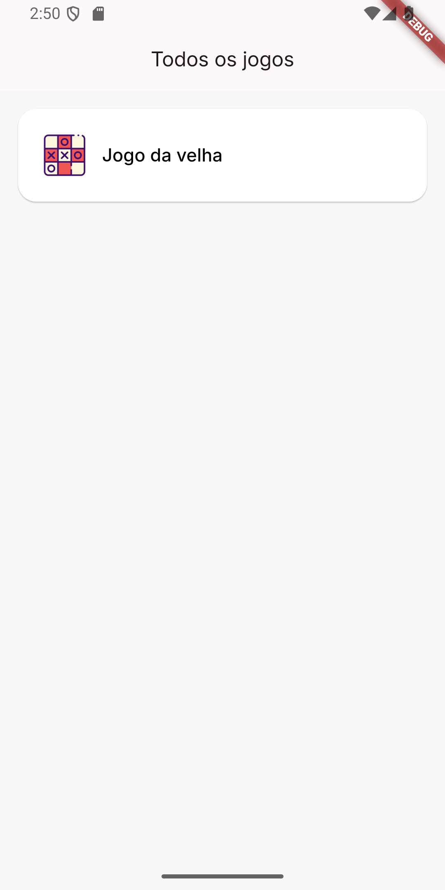
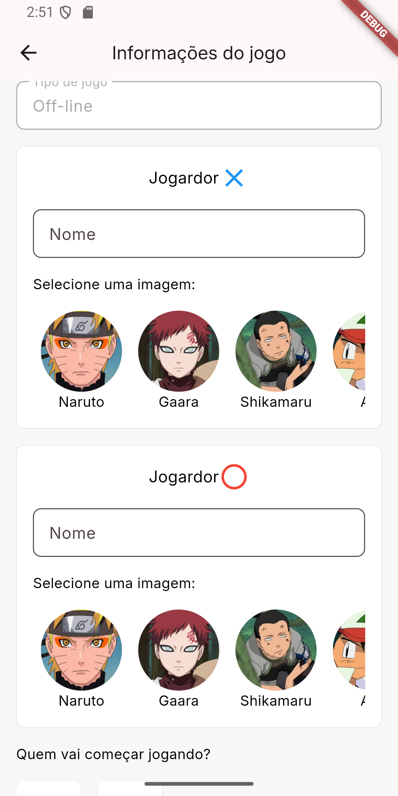
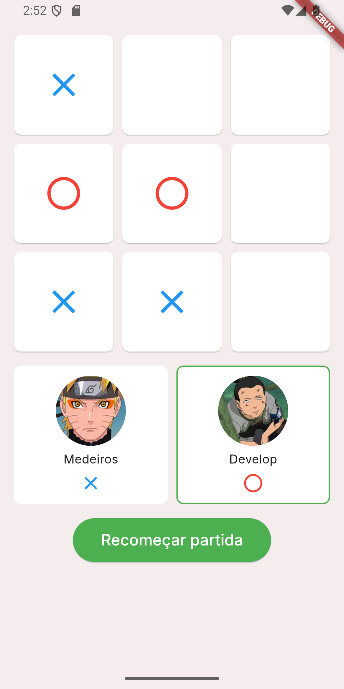
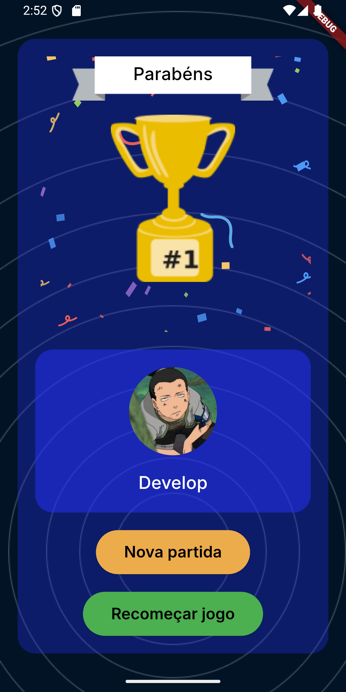

<h1 align="center">
  Jogo Flutter: Aplicação de Jogos Simples com Animações
</h1>

## 💻 Projeto

Este projeto é uma aplicação de jogos simples desenvolvida em Flutter, com o objetivo de aprimorar meus conhecimentos na criação de interfaces interativas e explorar a implementação de animações no Flutter.

A aplicação oferece uma seleção de jogos básicos, onde o foco principal é proporcionar uma experiência de usuário envolvente e fluida, utilizando animações para melhorar a interatividade e a jogabilidade. Durante o desenvolvimento, foram aplicados diversos conceitos de Flutter, como widgets personalizados, navegação entre telas e a implementação de animações.
<br>

## ⓘ Objetivo

- Aprender a criar jogos simples e interativos usando Flutter.
- Estudar e implementar animações no Flutter para melhorar a experiência do usuário.
  <br><br>


## ✅ Jogos existenstes e suas regras

### Jogo da Velha
- O jogo é off-line e é jogado por dois jogadores;
- Após selecionar o jogo "Jogo da velha", vai abrir uma tela para adicionar as informações dos jogadores;
- Após adicionar as iformações do josgadores e selecionar quem vai começar "X" ou "O", clique em iniciar par acomeçar;
- O jogo possui as regras padões do jogo da velha, mas com uma pequena modificação a partr da terçeira jogada de cada jogador;
- Depois que o jogador fizer a terçeira jogada, para fazer a próxima ele deve segurar de onde ele querer tirar e arrastar para onde ele quer jogar;
- Assim só irão apracer 3 "X" e 3 "O" no tabuleiro;
- O vencedor é o jogador que conseguir alinhar três símbolos consecutivos, seja na horizontal, vertical ou diagonal.


<br>

## ✅ Resultado do projeto

<h1 align="center">
  
  
  
  
    
</h1>


<br>

## 🎲 Executar
### Ambiente
- Certifique-se de que tenha o flutter configurado em sua máquina;
- A versão utilizada nesse projeto é a 3.27.1


### Projeto
1. Clone o repositório e entre na pasta:

   ```bash
   git clone  https://github.com/WillianMedeiros14/games_in_flutter.git
   cd games_in_flutter
   ```

2. Baixe as dependências:

   ```bash
   flutter pub get
   ```

3. Execute a aplicação:
- Depois de ter realizado os passos anteriores, pode rodar normalmente o aplicativo. 

<br>

## 🚀 Principais recursos e tecnologias ultilizadas
- **[Flutter](https://flutter.dev/)**.
- **[Lottie](https://pub.dev/packages/lottie)**.

